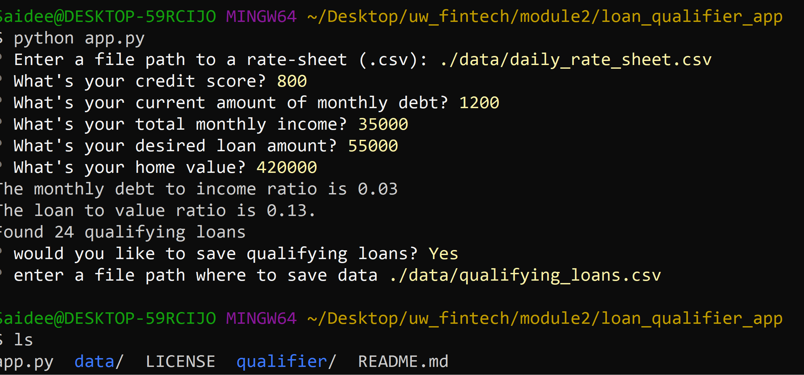
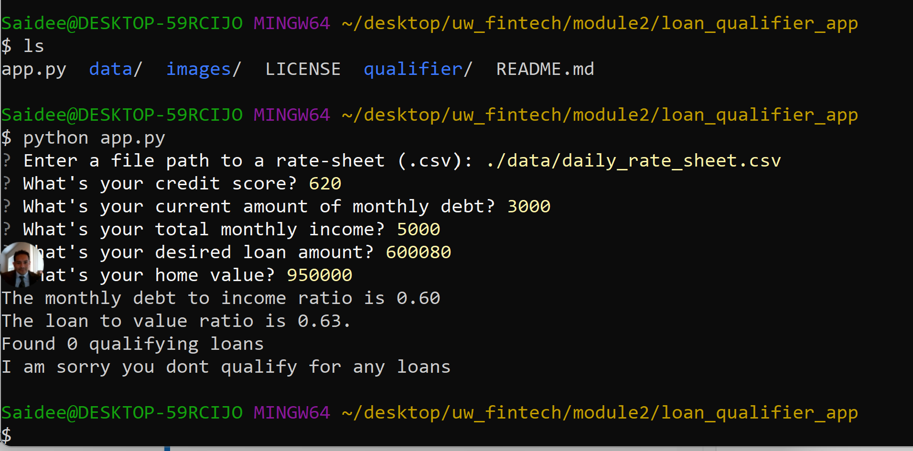

# Loan Qualifier App

## Use Case
This app gives the user loans available based on financial information entered by the user

---
## Technologies used
    Phyton Version: **3.7.13**

## Libraries and info:
**[Pathlib](https://docs.python.org/3/library/pathlib.html), [Fire](https://github.com/google/python-fire), [Questionary](https://pypi.org/project/questionary/)**

---
## How to run

1. Clone the file from GIT
2. Save the file to a folder path
3. Install the following Python libraries

    ## Python Fire: 
    Fire provides a command line interfaces (CLIs) for Pyhon code
    
    
        https://github.com/google/python-fire
    
    How to install:

        pip install fire

    ## Python Questionary: 
    This package allows the CLI to interact with the user in a question and answer format

        pip intall questionary

4. Run the application from the command line or gitbash

        python app.py

---
## DEMO
When the user qualifies for a loan, the app gives the user a list of loans available based on the user's financial data and it gived the user an option to save the file on a given folder path.

When the user does not qualify for a loan, the app returns a polite rejection message.

---
## Contributors
Startup code provided by UW FinTech Bootcamp Program

---
## License
Loan Qualifier App is available through the MIT License for education and training purposes.

---
## Aknowledgements
* [Markdown Guide](https://www.markdownguide.org/basic-syntax/#reference-style-links)
